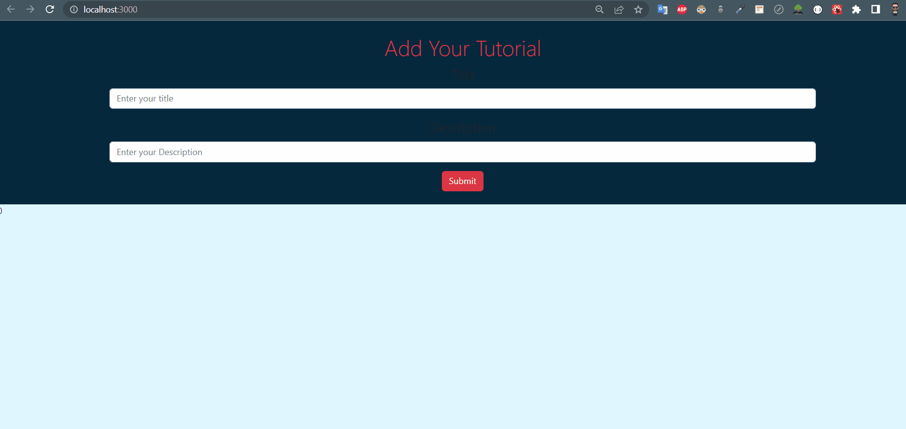

## Check The Live Website ➡️ [Live Website](https://osmankoyuncuu.github.io/react-tutorial/)

## Animation of the Website

## Description

Project aims to create a tutorial.

## Project Skeleton

    react-task-tracker
    |
    ├── public
    │     └── index.html
    │     └── favicon.ico
    ├── src
    │    ├── components
    │    │       ├── AddTutorial.jsx
    │    │       ├── EditTutorial.jsx
    │    │       ├── Loading.jsx
    │    │       └── TutorialList.jsx
    │    ├── img
    │    │    └── loading.jpg
    │    ├── pages
    │    │    └── Home.jpx
    │    ├── App.css
    │    ├── App.js
    │    └── index.js
    ├── .gitignore
    ├── package.json
    ├── README.md
    ├── tutorial.gif
    └── yarn.lock

## Overview

I mastered HTML, CSS, React and Bootstrap features in this project. You can see the visual representation of the website above.

# API Base URLs

## https://cw-axios-example.herokuapp.com/api/tutorials

### API ENDPOINTS

- GET `api/tutorials` get all Tutorials
- GET `api/tutorials/:id` get Tutorial by id
- POST `api/tutorials` add new Tutorial
- PUT `api/tutorials/:id` update Tutorial by id
- DELETE `api/tutorials/:id` remove Tutorial by id
- DELETE `api/tutorials` remove all Tutorials
- GET `api/tutorials/published` find all published Tutorials
- GET `api/tutorials?title=[keyword]` find all Tutorials which title contains 'keyword'
